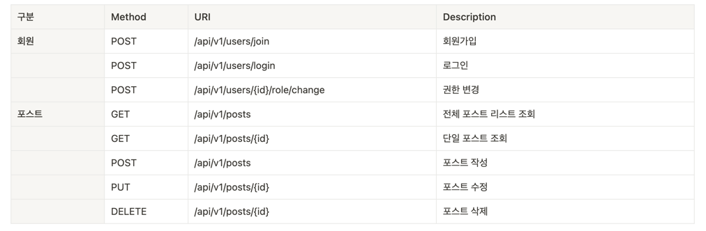
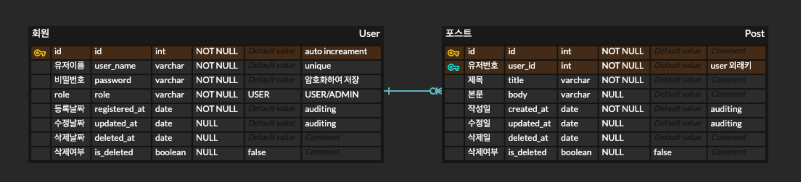

### 미션 요구사항 분석 & 체크리스트

---
[📎 노션 프로젝트 페이지](https://www.notion.so/0111dd15420243a19ed94263bc07932d)

[📎 Swagger-ui](http://ec2-13-125-252-76.ap-northeast-2.compute.amazonaws.com:8080/swagger-ui/)

---

- [x] [요구사항정의서 작성](https://gaudy-vein-afc.notion.site/caaa1915dc2b4715bf7310ab01c636f2)

#### 👉 인프라
- [x] [EC2 생성 및 도커 설치](https://gaudy-vein-afc.notion.site/EC2-efbe55d48a24448d89ec0157d9af7d9e)
- [x] [프로젝트 빌드](https://gaudy-vein-afc.notion.site/125f2714d006422690c53d84767b4540)
- [x] [GitLab CI/CD 구축](https://gaudy-vein-afc.notion.site/GitLab-CI-CD-20a04d8afcd0448bba16d7844d10f038)

#### 👉 DB
- [x] [DB 설계](https://gaudy-vein-afc.notion.site/DB-abf6dc6e5d2b43dcb3174cc459a95af0)
- [x] MySql 구축

#### 👉 프로젝트 설정
- [x] [entity 생성](https://gaudy-vein-afc.notion.site/entity-b93c520ad9564eeba3a03f3ec58a658b)
- [x] [security 설정](https://gaudy-vein-afc.notion.site/security-79dcd316427c47cdb1e03e1848642b68)
- [x] [예외처리, custom exception](https://gaudy-vein-afc.notion.site/d97e891832194deeab9895892dc9673e)

#### 👉 기능 개발
##### 회원
- [x] [회원 가입](https://gaudy-vein-afc.notion.site/36bcc1fbd6b5482a8a900d1f2adc2417) / [테스트코드](https://gaudy-vein-afc.notion.site/f822f9aa85e444909ef9004bfbf50401)
- [x] [로그인](https://gaudy-vein-afc.notion.site/8da836987de745dc95e41af3fafe9aa7) / [테스트코드](https://gaudy-vein-afc.notion.site/8facd4f4e42a4e35a3d5e8c782946292)
- [x] [권한변경](https://gaudy-vein-afc.notion.site/ADMIN-73b969019ea344e78d0f21de600381e6)

##### 포스트
- [x] [포스트 리스트 조회](https://gaudy-vein-afc.notion.site/a2aa0f0f7e554e779da5f0abaa2dfdf2) / 테스트코드
- [x] [포스트 작성](https://gaudy-vein-afc.notion.site/f7f9d98d8b114e4d8343c1bbdc100916) / [테스트코드](https://gaudy-vein-afc.notion.site/15ad2c245bba46b7a49d5eff63487af9)
- [x] [포스트 수정/삭제](https://gaudy-vein-afc.notion.site/ec91f4f5fe0c47b69c1820dbbd5ba947) / [테스트코드](https://gaudy-vein-afc.notion.site/fac2f76f2468463d8ea83e2c84bd1be3)
- [x] [포스트 상세 조회](https://gaudy-vein-afc.notion.site/235378165a0e42fd941893de7f1bd0cc) / [테스트코드](https://gaudy-vein-afc.notion.site/a965e3052b934275a6b8beae90178058)

#### 문서
- [x] [Swagger annotaion](https://gaudy-vein-afc.notion.site/swagger-annotaion-9d2df2a64508411bb3394a1b296ddf1d)
- [x] API 기능 명세서 작성

### 1주차 미션 요약

---

**[접근 방법]**

[📎 노션 프로젝트 페이지](https://www.notion.so/0111dd15420243a19ed94263bc07932d)

- 프로젝트 설계
  - GitLab, Docker, EC2를 이용한 CI/CD 구현
  - DB 설계 및 ERD 작성

- ecurity
  - Jwt를 이용한 인증 구현
  - FilterChain 상의 예외 처리
  - URI별로 인증, 권한 설정

- Test Code
  - Security를 포함하는 테스트코드 작성
  - CustomMockUser를 이용하여 athentication 자체제작
  - JwtFilter 자체를 테스트하기 위한 코드 작성
  - 테스트코드 관련 annotation 활용
  - MockMvc를 이용한 테스트 코드 구현

- ADMIN 권한 설정
  - security를 이용하여 권한에 따른 접근 범위 설정

- Swagger
  - annotation
  - API 문서 설계 시 참조

**[특이사항]**

- 신경썼던 부분 
  : 구현하면서 가장 어렵고 시간이 많이 걸렸던 부분은 아무래도 🔒 Security와 ✅ 테스트코드였다. 특히나 Security가 맞물린 테스트코드는 몹시 힘들었다.
  그래도 해보고 싶은 것들은 다 해보아서 뿌듯하다. 
    또한 이번에 CI/CD를 처음 적용해보았는데, 너무나 편하고 잡무가 확 줄었다. `.gitlab-ci.yml`, `Dockerfile`, 배포 스크립트 등을 직접 찾아보고 개선하는 과정에서 새로운 문법을 익히느라 시간은 오래 걸렸지만 재미있기는 했다.

- 개선해야할 부분
  : 수많은 **DTO와 메서드들의 명칭**들을 좀 더 명확하게 손보고 싶다.
또한 복잡한 부분은 주석을 사용하기는 했지만, 다른 사람과 공유하기에는 부족한 부분이 많은 듯하다. 한 눈에 <u>알아보기 쉽게 주석과 변수 명칭을 개선</u>할 것이다.