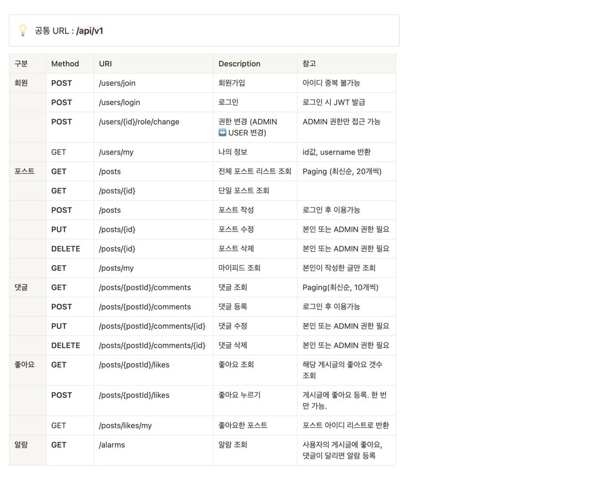

### 프로젝트 목표

- SpringBoot + JPA + JWT 를 이용하여 트위터와 유사한 SNS 서비스를 만든다.

### 미션 요구사항 분석 & 체크리스트

---
[📎 노션 프로젝트 페이지](https://www.notion.so/0111dd15420243a19ed94263bc07932d)

[📎 Swagger-ui](http://ec2-13-125-252-76.ap-northeast-2.compute.amazonaws.com:8080/swagger-ui/)

[📎 서비스 페이지](http://ec2-13-125-252-76.ap-northeast-2.compute.amazonaws.com:8080/)

---
#### 📌 프로젝트 기술스택
- 에디터 : Intellij Ultimate
- 개발 툴 : SpringBoot 2.7.6
- 자바 : JAVA 11
- 빌드 : Gradle 6.8
- 서버 : AWS EC2
- 배포 : Docker
- 데이터베이스 : MySql 8.0
- 필수 라이브러리 : SpringBoot Web, MySQL, Spring Data JPA, Lombok, Spring Security, JWT, Swagger, Oauth2-client

#### 📌 기능명세서

#### 📌 ERD ([erdcloud](https://www.erdcloud.com/d/QRsmFiJDNvBxfQXqm))

#### 📌 ERROR CODE
| 에러 코드 | 설명                                                                           | HTTP status |
| --- |------------------------------------------------------------------------------|-------------|
| DUPLICATED_USER_NAME | 중복된 아이디로 가입을 요청한 경우                                                          | 409         |
| USERNAME_NOT_FOUND | 가입되지 않은 아이디로 요청한 경우                                                          | 404         |
| INVALID_PASSWORD | 비밀번호가 틀린 경우                                                                  | 401         |
| INVALID_TOKEN | 유효하지 않은 토큰으로 요청한 경우                                                          | 401         |
| INVALID_PERMISSION | 해당 API에 대한 요청 권한이 없는 경우,  올바르지 않은 헤더로 요청한 경우,  게시글에 대한 수정/삭제 권한이 없는 경우 | 401         |
| POST_NOT_FOUND | 존재하지 않는 게시물을 요청한 경우                                                          | 404         |
| COMMENT_NOT_FOUND | 존재하지 않는 댓글을 요청한 경우                                                           | 404         |
| DATABASE_ERROR | DB와의 연결 이상인 경우                                                               | 500         |
| INTERNAL_SERVER_ERROR | 서버에서 요청 처리 중 오류가 발생한 경우                                                      | 500         |
| INVALID_VALUE | 지원하지 않는 포맷 입력                                                                | 400         |
| INVALID_REQUEST | 올바르지 않은 방법으로 요청한 경우,  좋아요를 2회이상 요청한 경우 | 409         |

### 1️⃣ 체크리스트
- [x] 요구사항정의서 작성

#### ‣ 인프라
- [x] [EC2 생성 및 도커 설치](https://velog.io/@coastby/AWS-Docker-aws-ec2-instance%EC%97%90-docker-%EC%84%A4%EC%B9%98%ED%95%98%EA%B8%B0)
- [x] 프로젝트 빌드
- [x] [GitLab CI/CD 구축](https://gaudy-vein-afc.notion.site/GitLab-CI-CD-20a04d8afcd0448bba16d7844d10f038)

#### ‣ DB
- [x] [DB 설계](https://gaudy-vein-afc.notion.site/DB-abf6dc6e5d2b43dcb3174cc459a95af0)
- [x] [MySql 구축](https://velog.io/@coastby/AWS-Docker-aws-ec2-instance%EC%97%90-docker-%EC%84%A4%EC%B9%98%ED%95%98%EA%B8%B0)

#### ‣ 프로젝트 설정
- [x] [entity 생성](https://gaudy-vein-afc.notion.site/entity-b93c520ad9564eeba3a03f3ec58a658b)
- [x] [security 설정](https://gaudy-vein-afc.notion.site/security-79dcd316427c47cdb1e03e1848642b68)
- [x] [예외처리, custom exception](https://gaudy-vein-afc.notion.site/d97e891832194deeab9895892dc9673e)

#### ‣ 기능 개발
회원
- [x] [회원 가입](https://gaudy-vein-afc.notion.site/36bcc1fbd6b5482a8a900d1f2adc2417) / 테스트코드
- [x] 로그인 / 테스트코드
- [x] [권한변경](https://gaudy-vein-afc.notion.site/ADMIN-73b969019ea344e78d0f21de600381e6) / 테스트코드

포스트
- [x] 포스트 리스트 조회 / 테스트코드
- [x] 포스트 작성 / [테스트코드](https://gaudy-vein-afc.notion.site/15ad2c245bba46b7a49d5eff63487af9)
- [x] [포스트 수정/삭제](https://gaudy-vein-afc.notion.site/ec91f4f5fe0c47b69c1820dbbd5ba947) / [테스트코드](https://gaudy-vein-afc.notion.site/fac2f76f2468463d8ea83e2c84bd1be3)
- [x] [포스트 상세 조회](https://gaudy-vein-afc.notion.site/235378165a0e42fd941893de7f1bd0cc) / 테스트코드

문서
- [x] [Swagger annotaion](https://gaudy-vein-afc.notion.site/swagger-annotaion-9d2df2a64508411bb3394a1b296ddf1d)
- [x] API 기능 명세서 작성

#### ‣ 기능 개발
댓글
- [x] 리스트 조회 
- [x] 댓글 작성
- [x] 댓글 수정/삭제

좋아요
- [x] 좋아요 누르기
- [x] 좋아요 개수 조회

- [x] 알람
- [x] 마이피드

#### ‣ [OAuth](https://gaudy-vein-afc.notion.site/OAuth-d362d0e5ca634527af779c1564550053)
- [x] 기능 구현

#### ‣ [UI 개발](https://gaudy-vein-afc.notion.site/UI-ea15ce629ddb44458d1287f70f52695f)
- [ ] 기능 개발

### 1️⃣주차 미션 요약

---

**[접근 방법]**

[📎 노션 프로젝트 페이지](https://www.notion.so/0111dd15420243a19ed94263bc07932d)

- GitLab, Docker, EC2를 이용한 <u>CI/CD 구현</u>
- DB 설계 및 ERD 작성
- 포스트 논리삭제 (soft delete) 구현

- Security
  - <u>Jwt</u>를 이용한 인증 구현
  - FilterChain 상의 예외 처리
  - URI별로 인증, 권한 설정

- Test Code
  - Security를 포함하는 테스트코드 작성
  - @WithMockCustomUser를 이용하여 authentication 커스텀
  - JwtFilter 자체를 테스트하기 위한 코드 작성
  - 테스트코드 관련 annotation 활용
  - MockMvc를 이용한 테스트 코드 구현

- ADMIN 권한 설정
  - security를 이용하여 권한에 따른 접근 범위 설정

- Swagger
  - annotation
  - API 문서 설계 시 참조

- OAuth2 적용
  - 구글, 네이버 로그인을 진행하면 기존의 로그인 방식대로 JWT 토큰 발급

- UI 개발
  - 포스트 조회, 댓글 조회, 댓글 작성, 좋아요 누르기 가능
  - 로그인, 포스트/댓글 작성/수정/삭제 추후 개발 예정 

**[특이사항]**

#### 신경썼던 부분 
구현하면서 가장 어렵고 시간이 많이 걸렸던 부분은 아무래도 🔒 **Security**와 ✅ **테스트코드**였다. 특히나 Security가 맞물린 테스트코드는 몹시 힘들었다.
그래도 해보고 싶은 것들은 다 해보아서 뿌듯하다. 
  또한 이번에 **CI/CD**를 처음 적용해보았는데, 너무나 편하고 잡무가 확 줄었다. `.gitlab-ci.yml`, `Dockerfile`, 배포 스크립트 등을 직접 찾아보고 개선하는 과정에서 새로운 문법을 익히느라 시간은 오래 걸렸지만 재미있기는 했다.

#### 개선해야할 부분
수많은 **DTO와 메서드들의 명칭**들을 좀 더 명확하게 손보고 싶다.
또한 복잡한 부분은 주석을 사용하기는 했지만, 다른 사람과 공유하기에는 부족한 부분이 많은 듯하다. 한 눈에 <u>알아보기 쉽게 주석과 변수 명칭을 개선</u>할 것이다.

### 2️⃣주차 미션 요약

---

**[접근 방법]**
- 댓글, 좋아요, 알람 개발
  - ERD를 이용하여 엔티티간의 관계 정리
  - 단일 책임 원칙을 준수하기 위한 고민

- OAuth2 적용
  - 구글, 네이버 로그인을 진행하면 기존의 로그인 방식대로 JWT 토큰 발급

- UI 개발
  - 포스트 조회, 댓글 조회, 댓글 작성, 좋아요 누르기 가능
  - 로그인, 포스트/댓글 작성/수정/삭제 추후 개발 예정 

**[특이사항]**

#### 신경썼던 부분
이번에도 spring-security 관련하여 이해해야할 부분이 많았다. 디버깅을 하여 security 과정을 몇 번이나 보게되었다... 보안 로직이 OAUth를 적용하면서 어수선해졌지만, 이는 리팩토링을 하며 깔끔하게 개선해 나갈 것이다. 
spring-security가 다른 서버와의 전송을 도와주었지만, 간접적이게나마 서버간의 통신을 경험할 수 있었다.  

#### 개선해야할 부분
리프레시 토큰 및 OAuth 관련 로직 개선이 필요하다. JWT 토큰 발급은 가능하지만 예외 상황 핸들링, 리다이렉트 등을 더 개선해야 한다. 
댓글, 좋아요, 알람 등 다양한 엔티티들이 생기면서 서로 간의 관계를 풀어가는 것이 어려웠다. 아직도 이들의 관계를 어느 클래스에서 다뤄야할 지는 명확하지 않다. 그래서 규칙성없이 섞여있는 느낌이다. 
미리 설계를 하고 개발을 시작하지만 그럼에도 변경사항들이 많아서 처참하게 되어버린 코드들이 많다. 이를 리팩토링하는데에도 꽤 많은 시간이 소모되었다. 하지만 구현하면서 보이는 버그들도 많아서 설계에만 비중을 두기에는 비효율적인 부분도 있다.
나만의 개발 루틴을 만들어서 효율적으로 시간을 써야겠다는 생각을 했다.